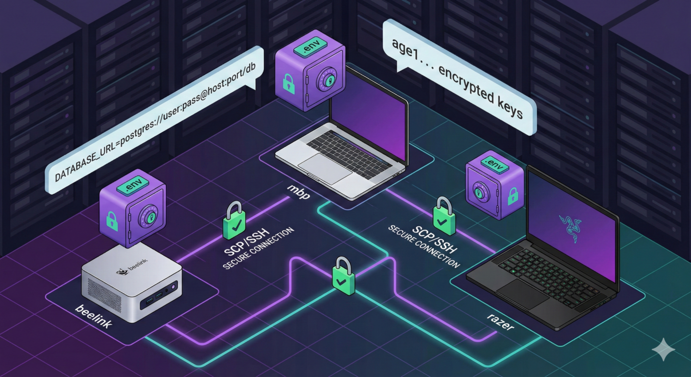

# env-sync

[](https://go.dev/)
[](https://www.openssh.com/)
[](https://age-encryption.org/)

[](https://kernel.org/)
[](https://apple.com/macos/)
[-Supported-0078D6?logo=windows11&logoColor=white)](https://docs.microsoft.com/en-us/windows/wsl/)
[](https://github.com/championswimmer/env.sync.local/actions/workflows/bats-tests.yml)

Distributed secrets synchronization for local networks. Sync your `.env` files securely across multiple machines with three operation modes for different trust scenarios.



## Quick Start

### Installation

```bash
# System-wide install
curl -fsSL https://envsync.arnav.tech/install.sh | sudo bash

# User install (no sudo)
curl -fsSL https://envsync.arnav.tech/install.sh | bash -s -- --user
```

See [INSTALLATION.md](./docs/INSTALLATION.md) for detailed platform-specific instructions.

### Initial Setup

```bash
# Initialize (creates secrets file with mode-appropriate defaults)
env-sync init

# Add secrets
env-sync add OPENAI_API_KEY="sk-..."
env-sync add DATABASE_URL="postgres://..."

# Sync with peers
env-sync

# Optional: Set up periodic sync
env-sync cron --install
```

## Three Security Modes

env-sync v3.0+ operates in three distinct modes designed for different trust scenarios:

| Mode | Storage | Transport | Use Case |
|------|---------|-----------|----------|
| **trusted-owner-ssh** | Plaintext (opt: encrypted) | SCP/SSH | Same owner, mutually trusted devices (default) |
| **secure-peer** | AGE Encrypted | HTTPS+mTLS | Cross-owner collaboration without SSH trust |
| **dev-plaintext-http** | Plaintext | HTTP | Local debugging only |

### Mode B: Trusted-Owner-SSH (Default)

For syncing secrets across your own devices.

- **Zero-touch peer addition**: New machines join without touching existing ones
- **Optional encryption**: Enable with `--encrypted` flag
- **Simple setup**: Just needs SSH keys between devices

```bash
# Default mode - works out of the box
env-sync init
env-sync
```

### Mode C: Secure-Peer

For collaborating across different owners without sharing SSH access.

- **Invitation-based onboarding**: Peers must be approved
- **Mandatory encryption**: AGE encryption at rest
- **mTLS transport**: Certificate-based mutual authentication

```bash
# Switch to secure mode
env-sync mode set secure-peer

# Create invitation
env-sync peer invite --expires 1h

# On new machine, request access
env-sync peer request-access --to hostname.local --token <token>

# Approve from existing peer
env-sync peer approve new-host.local
```

See [SECURITY-MODES.md](./docs/SECURITY-MODES.md) for detailed security analysis and threat models.

## Common Commands

```bash
# Sync with peers
env-sync

# Manage secrets
env-sync add KEY="value"
env-sync remove KEY
env-sync list
env-sync show KEY

# Load secrets for shell
eval "$(env-sync load)"

# Mode management
env-sync mode get
env-sync mode set secure-peer

# Peer management (secure-peer mode)
env-sync peer list
env-sync peer approve hostname.local

# Service management
env-sync serve -d        # Start background service
env-sync service stop    # Stop service
env-sync cron --install  # Set up periodic sync
```

See [USAGE.md](./docs/USAGE.md) for complete command reference.

## Shell Integration

Add to `~/.bashrc` or `~/.zshrc`:

```bash
# Auto-load secrets on startup
eval "$(env-sync load 2>/dev/null)"

# Auto-sync in background
if command -v env-sync &> /dev/null; then
    (env-sync --quiet &)
fi
```

## Documentation

- **[INSTALLATION.md](./docs/INSTALLATION.md)** - Detailed installation instructions for all platforms
- **[USAGE.md](./docs/USAGE.md)** - Complete command reference and workflows
- **[SECURITY-MODES.md](./docs/SECURITY-MODES.md)** - Security model details and threat analysis
- **[GUI.md](./docs/GUI.md)** - Desktop GUI application guide
- **[CHANGELOG.md](./CHANGELOG.md)** - Version history and release notes

## Features

- **Three Operation Modes**: Choose the right security model for your trust scenario
- **Desktop GUI**: Optional graphical interface with the same capabilities ([docs](./docs/GUI.md))
- **Distributed**: No master server, all machines are equal
- **Automatic Discovery**: Uses mDNS/Bonjour to find peers
- **Easy Expansion**: Add new machines without touching existing ones (trusted-owner mode)
- **Explicit Authorization**: Approve peers individually (secure-peer mode)
- **Transparent Decryption**: Works seamlessly in shell, cron, and manual sync
- **Backup System**: Automatic backups before overwriting
- **Cross-Platform**: Linux, macOS, and Windows (WSL2)

## Architecture

```
Machine A                      Machine B
┌──────────┐                   ┌──────────┐
│  mDNS    │◄────discovery────►│  mDNS    │
│  (port   │                   │  (port   │
│  5739)   │                   │  5739)   │
└────┬─────┘                   └────┬─────┘
     │                              │
┌────▼─────┐                   ┌────▼─────┐
│  SSH or  │◄───sync secrets──►│  SSH or  │
│  HTTPS   │                   │  HTTPS   │
│ +mTLS    │                   │ +mTLS    │
└────┬─────┘                   └────┬─────┘
     │                              │
┌────▼─────┐                   ┌────▼─────┐
│ .secrets │                   │ .secrets │
│   .env   │                   │   .env   │
└──────────┘                   └──────────┘
```

## File Locations

```
~/.config/env-sync/
├── config                 # Config file
├── .secrets.env          # Secrets (encrypted or plaintext)
├── .secrets.env.backup.* # Backups (last 5)
├── keys/                 # AGE keys, transport certificates
├── peers/                # Peer registry (secure-peer mode)
├── events/               # Membership events
└── logs/                 # Application logs
```

## Building from Source

```bash
git clone https://github.com/championswimmer/env.sync.local.git
cd env.sync.local

# Build CLI
make build

# Ubuntu/Debian GUI prerequisites (GUI builds only)
sudo apt-get update
sudo apt-get install -y pkg-config libgtk-3-dev libwebkit2gtk-4.1-dev

# Build GUI (requires Node.js 18+)
make build-gui

# Build both
make build-all

# Test
make test

# Install CLI only
sudo make install

# Install GUI into the platform app location
sudo ./install.sh --gui-only

# Install both CLI + GUI
sudo ./install.sh --all
```

See [INSTALLATION.md](./docs/INSTALLATION.md) for more options.

## Security

Security depends on your chosen mode:

- **trusted-owner-ssh**: SSH provides encrypted transport; plaintext storage is honest default when all peers are equally trusted
- **secure-peer**: AGE encryption + mTLS for scenarios without mutual SSH trust
- **dev-plaintext-http**: No security, debugging only

See [SECURITY-MODES.md](./docs/SECURITY-MODES.md) for comprehensive threat models.

## Contributing

1. Check [AGENTS.md](./AGENTS.md) for technical architecture
2. Test all three modes if modifying core sync logic
3. Update documentation for user-facing changes
4. Follow Go conventions (`gofmt`, `go vet`)
5. Add tests for new functionality

## License

MIT License

## Changelog

See [CHANGELOG.md](./CHANGELOG.md) for version history.

---

**Note**: env-sync is designed for local networks. Do not expose the HTTP server to the public internet.
